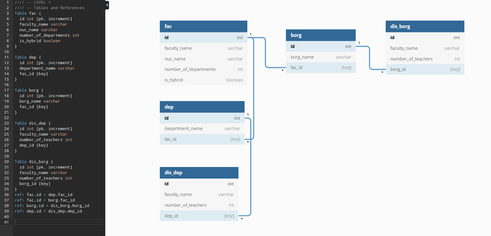

# DBMS

**DBMS** - special-purpose (universities) database management system. The work is still in progress.

All commands are case insensitive (but not names!). Commands are also have to end with semicolon (';'). Here are several guide aliases for custom values: <db> - database name, <tb> - table name, <cl> - column name, <val> - value, <sgn> - sign (=|>|<). For more information type *help* in program.

Here are the relational database project:



## Проверка выполнения задания

### Запуск

При запуске программа ищет файл *.config*. Файл ищется в папке, из которой запускается исполняемый файл, или же на одну директорию выше. После нахождения вышеуказанного файла директория, в которой он располагается, обозначается корневой. В ней будут располагаться папка с базами данных *.database*. В ней же будет искаться папка *scripts* со скриптами, запускаемыми командой *source*. Если файл *.config* не будет найден, программа не запустится. Пожалуйста, следите за тем, чтобы вложенность исполняемого файла по отношению к *.config*  не превышала 1.
<br><br>
### Общая информация

После запуска вы увидите терминал DBMS:
```
DBMS [(none)]> 
```
Впредь для обозначения строки ввода DBMS будет использоваться символ '>'.

*None* означает, что ни одна из баз данных не используется в данный момент. Чтобы использовать (открыть, изменять, получать информацию) БД введите команду:
```
> USE < название БД >;
```
( после запуска будет доступна лишь системная БД ). 
После открытия БД, на месте *none* будет ее название.

Команды, выполняемые внутри терминала DBMS, регистронезависимые. Однако названия таковыми *не являются*! Все команды также должны заканчиваться ';'. Команды могут быть многострочными.

### Выполнение скриптов (эскпериментальная БД)

Для развёртывания экспериментальной базы данных используйте команду **SOURCE example_db.dbms;**. Скрипты располагаются в папке *scripts*. Вы также можете написать свои, используя команды терминала DBMS (более подробную информацию о них можно посмотреть c помощью команды  **help** внутри DBMS). Циклы и условные конструкции отсутствуют. Скрипт прекратит свое выполнение на команде, которая будет не выполнена или выполнена неверно, выведя в терминал информацию о причинах своей остановки, а также саму команду, которая не была выполнена успешно. Комментарии в скриптах начинаются с символа '#'.

### Команды интерфейса DBMS

1. **Создание однотипных и гибридных БД**
    
    Чтобы создать однотипную базу данных, используйте команду 
    ```
    > CREATE DATABASE < название бд > (type=common);
    ```
    При создании такой БД тип может быть опущен. 

    Для создания гибридной БД:  
    ```
    > CREATE DATABASE < название бд > (type=hybrid);
    ```
    Запрещено создавать БД с одинаковыми названиями. 
<br>

2. **Вывод на экран списка существующих БД**
    
    Для просмотра списка всех существующих баз данных используется команда:
    ```
    > SHOW DATABASES;
    ```
    В выводе команды вы всегда увидите базу данных под названием *information_schema*. Она создается при первом запуске программы. В ней хранятся информация о всех существующих БД. При повреждении этого файла открыть другие базы данных будет невозможно, т. к. первичная информация при открытии БД всегда считывается отсюда.
<br>

3. **Удаление БД**
    
    Удаление базы данных производится посредством команды:
    ```
    > DROP DATABASE <название бд>;
    ```
    Производится удаление файла БД с диска. После чего удаляется информация о БД из *information_schema*. Если в момент удаления БД была открыта, то текущее состояние DBMS с названия на *none*.
